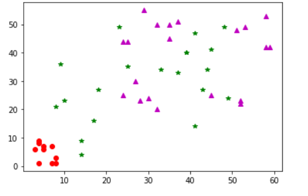
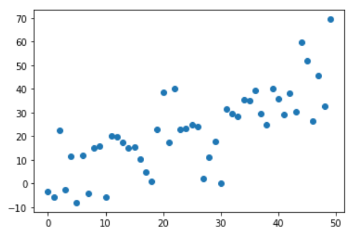
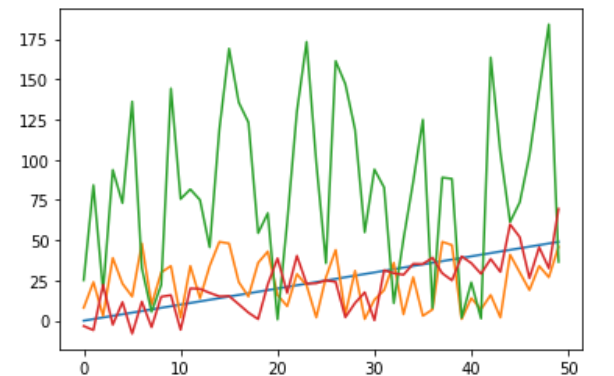
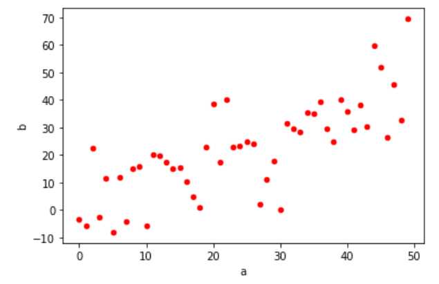
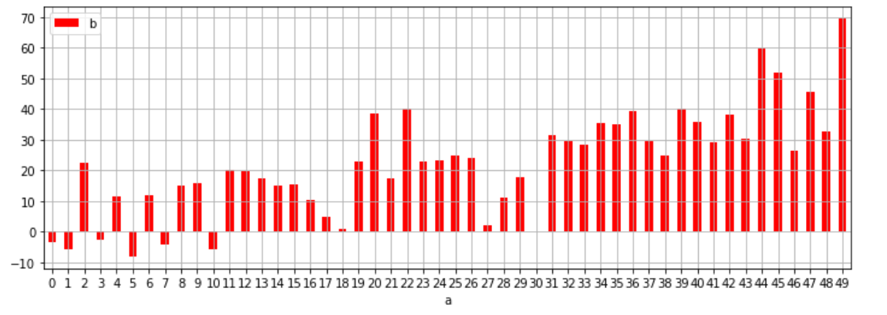

## plot()

___

plot()메소드를 통해 여러개의 그래프를 미리 만들어두고 plt.show()메소드를 사용하면 여러개의 그래프가 한 도면에 그려지는 것을 확인 할 수 있습니다. 또는 plot()메소드 안에 여러개의 그래프 형식을 넣을 수 있습니다. 

 

## plot()을 여러번 쓰기

___

~~~python
import numpy as np
t = np.arange(0,5,0.2)
plt.plot(t,t,'r--',t,t**2,'gs', t,t**3,'*')
plt.show()
~~~

{:width="40%" height="40%}

 

## plot()메소드 안에 여러 그래프를 설정하기

___

~~~python
import numpy as np
t = np.arange(0,5,0.2)
plt.plot(t,t,'r--',label='Tips')
plt.plot(t,t**2,'gs',label='Population')
plt.plot(t,t**3,'b^', label='Product Layer')

plt.legend()
plt.xlabel('Contents')
plt.ylabel('Count', rotation=0)
plt.show()
~~~

{:width="40%" height="40%}

 

## 인자값 실험

___

리스트 뿐만 아니라 numpy Array, Series도 들어갈 수 있습니다. 

~~~python
plt.plot(np.random.randint(0,10,10), np.random.randint(0,10,10), 'ro')
plt.plot(np.random.randint(0,50,20), np.random.randint(0,50,20), 'g*')
plt.plot(Series(np.random.randint(20,60,20)), Series(np.random.randint(20,60,20)), 'm^')
plt.show()
~~~

{:width="40%" height="40%}

 

## sin, cos그리기

___

여러 타입이 x, y인자값으로 들어갈 수 있기 때문에 아래와 같이 만들 수도 있습니다. 

~~~python
t = np.arange(0,12,0.01)
plt.plot(t, np.cos(t), 'r')
plt.plot(t, np.sin(t), 'c')
plt.plot(t, np.cos(t)*np.sin(t), 'g')
plt.xlabel('x axis')
plt.ylabel('y axis')
plt.title('SinCos graph')
plt.show()
~~~

~[consin](../../../static/assets/img/blog/data_analysis/03Matplotlib/consin.png){:width="40%" height="40%}

 

## figure()

새로운 그래프를 추가하려면 figure()메소드를 사용합니다. 

figure()메소드를 기준으로 plot()메소드를 다른 도표에 적용할 수 있습니다. 

~~~python
import numpy as np
import matplotlib.pyplot as plt
from pandas import DataFrame, Series

t = np.arange(0,12,0.01)
plt.figure(figsize=(8,5))
plt.plot(t, np.sin(t), 'r', lw=5, label='sin')
plt.plot(t, np.cos(t), 'b', label='cos')
plt.legend()
plt.xlabel('x axis')
plt.ylabel('y axis')
plt.title('SinCos Graph')

plt.figure(figsize=(8,5))
plt.plot(np.random.randint(0,10,10), np.random.randint(0,10,10), 'ro', label='red')
plt.plot(np.random.randint(0,50,20), np.random.randint(0,50,20), 'g*', label='green')
plt.plot(Series(np.random.randint(20,60,20)), Series(np.random.randint(20,60,20)), 'm^', label='magenta')
plt.legend()
plt.xlabel('x axis')
plt.ylabel('y axis')
plt.title('Random Graph')
plt.show()
~~~

{:width="40%" height="40%}

 

## DataFrame Visualizaton

___

마지막으로 DataFrame으로 시각화 작업을 해보도록 하겠습니다. 

~~~python
import numpy as np
from pandas import DataFrame
np.random.seed(100)
data = dict(a=np.arange(0,50,1), c=np.random.randint(0,50,50), d=np.random.randn(50))
data['b'] = data['a']+10 *np.random.randn(50)
data['d'] = np.abs(data['d'])*100
df1 = DataFrame(data)
df1.head()
~~~

{:width="30%" height="30%}

 

DataFrame의 각 열을 추출해서 x,y에 넣는 방법이 있습니다. 

~~~python
plt.plot(df1['a'], df1['b'], 'o')
plt.show()
~~~

{:width="40%" height="40%}

 

DataFrame객체를 넣는다면 전체 컬럼의 데이터가 각각 다른 색으로 찍힙니다. 

~~~python
plt.plot(df1)
plt.show()
~~~

{:width="40%" height="40%}

 

## PlotAccessor 이용하기 

___

DataFrame을 그리는 방법 중에서 가장 많이 쓰이는 것은 DataFrame객체에서 plotAccessor를 plot()함수로 불러오는 것입니다. 

~~~python
df1.plot(kind='scatter', x='a', y='b', color='r')
plt.show()
~~~
{:width="40%" height="40%}

 

## PlotAccessor definition

___

> Make plots of Series or DataFrame. 
> df.plot(*args, **kwargs)

Series나 DataFrame의 plot을 만다는 함수라고 정의되어있습니다. 

 

### 대표적인 파라미터 정의

* data : Series나 DataFrame을 넣습니다. (Series, DataFrame)  
* x : x 라벨 (str)
* y : y 라벨 (str)
* kind : 그래프의 종류 (str)
* figsize : 도면의 크기
* title : 그래프제목 (str)
* grid : 교차선 (bool)
* legend : legend 그리기(bool)
* rot : 눈금 방향.(int)
* fontsize : 눈금 크기(int)
* colormap : (str or matplotlib colormap obj)
* colorbar : bar의 색깔. ('scatter' and 'hexbin')에만 적용

 

### 그래프의 종류
- 'line' : line plot (default)
- 'bar' : vertical bar plot
- 'barh' : horizontal bar plot
- 'hist' : histogram
- 'box' : boxplot
- 'kde' : Kernel Density Estimation plot
- 'density' : same as 'kde'
- 'area' : area plot
- 'pie' : pie plot
- 'scatter' : scatter plot
 - 'hexbin' : hexbin plot.

 

~~~python
df1.plot(kind='bar', x='a', y='b', color='r', grid=True, legend=True, rot = 0, figsize=(12,4))
plt.show()
~~~

{:width="70%" height="70%}

 

